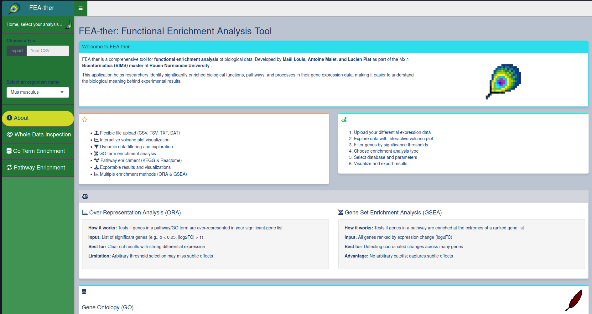

# FEAther (Functional Enrichment Analysis Tool)

## Overview

FEAther is a Shiny application designed for functional enrichment analysis of biological data. It allows users to upload CSV files, select various analysis options, and visualize results through interactive plots and tables. This tool is particularly useful for researchers and biologists who wish to gain insights from their data.

Preview of home page of the app:


## Authors

**Maël Louis, Antoine Malet and Lucien Piat**  
Affiliation: Rouen Normandie University  

## Features

- Data Upload: Accepts CSV, TXT, TSV, and DAT files with flexible format support.
- Data Inspection: Visual inspection of whole datasets, including customizable volcano plots.
- Customizable Output: Downloadable plots and tables in CSV and PNG formats.
- User-Friendly Interface: A clear, intuitive interface with custom themes and error handling.

## Requirements

To successfully run FEAther, please ensure your system meets the following requirements:

### Software

- **R**: version 4.4.3 or higher  
- **RStudio** (optional but recommended for local development)  
- **Docker**: version 20.10+ (for containerized deployment)  
- **Conda** (Miniforge or Anaconda): Optional, for managing R environments and dependencies  

### R Packages

All required R packages are listed in the `Feather_env.yml` conda environment file and can be installed automatically via conda or manually via R (see Installation section).

### Hardware

- Minimum 4 GB RAM (8 GB+ recommended for large datasets and smooth interactive use)  
- Internet connection (for initial package installation and online deployment)  

### Operating System

- Linux (tested on Arch Linux, Ubuntu)  
- macOS and Windows supported via Docker or RStudio with conda  

---

Make sure Docker daemon is running if using the Docker option.  
If installing manually, verify that your R installation can compile packages from source (build tools installed).

## Repository Structure

The file structure of the repository is as follows:

```bash
FEAther/
├── app.R                # Main file to run the Shiny app
├── server.R             # Server logic
├── ui.R                 # UI components and layout
├── functions.R          # Helper functions for graphics and data handling
├── shiny-server.conf    # Server config
├── www/                 # Directory for additional resources
│   ├── custom_theme.R       # Custom theme settings
│   ├── logo.png     
│   └── dodo.png          
└── Dockerfile           # Dockerfile to containerize the app
```

## Running the App

### With Docker (recommended)

Clone this repository to your local machine:

```bash
git clone https://github.com/Lucien-Piat/FEAther.git
cd FEAther
```

To run FEAther in a Docker container:

From the root of the FEAther directory, build the Docker image:

```bash
docker build -t feather_app .
```

Once the build is complete, run the container:

```bash
docker run -d -p 3838:3838 feather_app
```

Open a web browser and go to <http://localhost:3838> to use the FEAther application.

### Locally

Clone this repository to your local machine:

```bash
git clone https://github.com/Lucien-Piat/FEAther.git
cd FEAther
```

#### Install dependencies

##### Install via a conda environment (recommended)

```bash
conda env create -f FEAther_env.yml
conda activate FEAther
R
```

##### In R console / RStudio

Install any missing packages :

```R
# Base R packages
install.packages(c(
  "shiny", 
  "shinydashboard", 
  "shinycssloaders", 
  "shinyalert", 
  "dashboardthemes", 
  "DT", 
  "ggplot2", 
  "data.table", 
  "dplyr", 
  "plotly", 
  "shinyjs",
  "ggridges", 
  "shinyBS",
  "shinybusy"
))

# From Bioconductor
if (!requireNamespace("BiocManager", quietly = TRUE))
    install.packages("BiocManager", repos = "https://cran.rstudio.com/")

BiocManager::install(c("clusterProfiler", "org.Mm.eg.db", "org.Hs.eg.db", "DOSE", "pathview", "ReactomePA", "enrichplot"), ask = FALSE)

```

#### Running the App with CLI or RStudio

Open app.R in RStudio and ensure all files in the repository are loaded (set working directory).

Click Run App in RStudio or run the following command in the R console:

```R
library("shiny")
shiny::runApp()
```

### Online

Click this link : <https://lucien-piat.shinyapps.io/feather/>

## Dependencies

### List of packages

#### CRAN

- shiny  
- shinydashboard  
- shinycssloaders  
- shinyalert  
- dashboardthemes  
- DT  
- ggplot2  
- data.table  
- dplyr  
- plotly  
- shinyjs  
- ggridges  
- shinyBS  
- shinybusy  

#### Bioconductor

- clusterProfiler  
- org.Mm.eg.db  
- org.Hs.eg.db  
- DOSE  
- pathview  
- ReactomePA  
- enrichplot  

## 📖 Citations

### Packages Used in This Project

This project makes use of several R packages. If you are using any part of this project, please cite the following packages appropriately:

#### 📦 `shiny`

Chang W, Cheng J, Allaire J, Sievert C, Schloerke B, Xie Y, Allen J, McPherson J, Dipert A, Borges B (2024). _shiny: Web Application Framework for R_. R package version 1.10.0, 
<https://CRAN.R-project.org/package=shiny>.

#### 📦 `shinydashboard`

Chang W, Borges Ribeiro B (2021). _shinydashboard: Create Dashboards with 'Shiny'_. R package version 0.7.2,
<https://CRAN.R-project.org/package=shinydashboard>.

#### 📦 `shinycssloaders`

Attali D, Sali A (2024). _shinycssloaders: Add Loading Animations to a 'shiny' Output While It's Recalculating_. R package version 1.1.0, 
<https://CRAN.R-project.org/package=shinycssloaders>.

#### 📦 `shinyalert`

Attali D, Edwards T (2024). _shinyalert: Easily Create Pretty Popup Messages (Modals) in 'Shiny'_. R package version 3.1.0, 
<https://CRAN.R-project.org/package=shinyalert>.

#### 📦 `dashboardthemes`

Lilovski N (2022). _dashboardthemes: Customise the Appearance of 'shinydashboard' Applications using Themes_. R package version 1.1.6,
<https://CRAN.R-project.org/package=dashboardthemes>.

#### 📦 `DT`

Xie Y, Cheng J, Tan X (2024). _DT: A Wrapper of the JavaScript Library 'DataTables'_. R package version 0.33, 
<https://CRAN.R-project.org/package=DT>.

#### 📦 `ggplot2`

Wickham H (2016). _ggplot2: Elegant Graphics for Data Analysis_. Springer-Verlag New York.

#### 📦 `data.table`

Barrett T, Dowle M, Srinivasan A, Gorecki J, Chirico M, Hocking T, Schwendinger B, Krylov I (2025). _data.table: Extension of `data.frame`_. R package version 1.17.0,
<https://CRAN.R-project.org/package=data.table>.

#### 📦 `dplyr`

Wickham H, François R, Henry L, Müller K, Vaughan D (2023). _dplyr: A Grammar of Data Manipulation_. R package version 1.1.4, 
<https://CRAN.R-project.org/package=dplyr>.

#### 📦 `plotly`

Sievert C (2020). _Interactive Web-Based Data Visualization with R, plotly, and shiny_. Chapman and Hall/CRC Florida.

#### 📦 `shinyjs`

Attali D (2021). _shinyjs: Easily Improve the User Experience of Your Shiny Apps in Seconds_. R package version 2.1.0,
<https://CRAN.R-project.org/package=shinyjs>.

#### 📦 `clusterProfiler`

Yu G (2024). Thirteen years of clusterProfiler. The Innovation, 5(6):100722.  
Xu S, Hu E, Cai Y, Xie Z, Luo X, Zhan L, Tang W, Wang Q, Liu B, Wang R, Xie W, Wu T, Xie L, Yu G (2024). _Using clusterProfiler to characterize multiomics data._ Nature Protocols, 19(11):3292-3320.  
Wu T, Hu E, Xu S, Chen M, Guo P, Dai Z, Feng T, Zhou L, Tang W, Zhan L, Fu X, Liu S, Bo X, Yu G (2021). _clusterProfiler 4.0: A universal enrichment tool for interpreting omics data._ The Innovation, 2(3):100141.  
Yu G, Wang L-G, Han Y, He Q-Y (2012). _clusterProfiler: an R package for comparing biological themes among gene clusters._ OMICS: A Journal of Integrative Biology, 16(5):284-287.

#### 📦 `shinybusy`

Meyer F, Perrier V (2024). _shinybusy: Busy Indicators and Notifications for 'Shiny' Applications_. R package version 0.3.3,
<https://CRAN.R-project.org/package=shinybusy>.

#### 📦 `DOSE`

Guangchuang Yu, Li-Gen Wang, Guang-Rong Yan, Qing-Yu He. DOSE: an R/Bioconductor package for Disease Ontology Semantic and Enrichment analysis. Bioinformatics. 2015, 31(4):608-609

#### 📦 `pathview`

Luo, W. and Brouwer C., Pathview: an R/Bioconductor package for pathway-based data integration and visualization. Bioinformatics, 2013, 2 (14): 1830-1831, doi: 10.1093/bioinformatics/btt285

#### 📦 `ReactomePA`

Guangchuang Yu, Qing-Yu He. ReactomePA: an R/Bioconductor package for reactome pathway analysis and visualization. Molecular BioSystems. 2016, 12(2):477-479

#### 📦 `enrichplot`

Guangchuang Yu, Li-Gen Wang, Yanyan Han and Qing-Yu He. ClusterProfiler: an R package for comparing biological themes among gene clusters. OMICS: A Journal of Integrative Biology. 2012, 16(5):284-287

---

By using this project, you agree to cite the above packages where applicable. For further details on how to install or use each package, refer to their respective CRAN pages.

### Citing This Project

If you are using this project or referencing it in your own work, please use the following citation:

**Piat L., Louis M., Malet A., Dauchel H. (2025).** _FEAther._ [https://github.com/Lucien-Piat/FEAther].  
_(This project is part of an academic school work conducted at Université de Rouen Normandie, within the Master BIMS program, CFCA - Université de Rouen.)_

## 📜 License  

This project is licensed under the **Creative Commons Attribution-NonCommercial 4.0 International (CC BY-NC 4.0)**.  
You are free to share and modify this project, but **not for commercial purposes**.  
[License details](./LICENSE)
